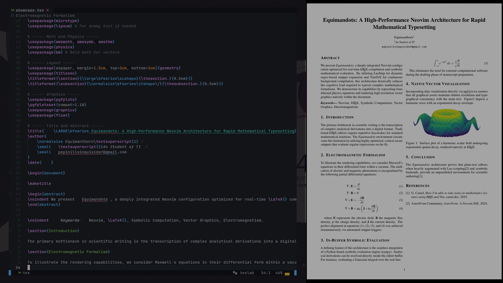

<div align="center">
  
  # 🦇 Equimandots
  **Blazing Fast LaTeX Editing Environment for Neovim**
  
  [](https://astronvim.com/)
  [](https://www.lua.org/)
  [](https://www.latex-project.org/)

  *Forged for speed, precision, and arcane mathematical incantations.*
</div>

---

**Equimandots** is a highly specialized Neovim configuration built on top of [AstroNvim](https://github.com/AstroNvim/AstroNvim). It is designed to achieve the highest possible speed when typesetting mathematics in LaTeX, deeply inspired by the legendary workflow of Gilles Castel.

## 📸 Showcase


<br>

## ✨ Key Features

- **⚡ Instant Math Expansion:** Over 130 context-aware LuaSnip auto-snippets that evaluate regex on the fly.
- **🔮 Symbolic Evaluation:** Built-in Python/Sympy integration. Evaluate complex integrals and algebraic expansions directly inside the buffer.
- **👁️ Clean Workspace:** `latexmk` output files are automatically routed to a `build/` directory. Your project root stays pristine.
- **🧠 Dynamic Spell Check:** Automatically switches dictionaries (`en_us`, `es`) based on your directory structure. Includes instant `Ctrl+L` correction.
- **📊 Inline Previews:** ASCII art equation rendering via `nabla.nvim` without needing to compile.

For a full breakdown of all available snippets and shortcuts, please refer to the documentation:

👉 **[Full LaTeX Features & Snippets Guide](docs/latex_features_summary.md)**

## 📦 Prerequisites

Before installing, ensure your system meets the following requirements:

- **Neovim** (v0.9.5+)
- **Git**, **Make**, **unzip**, **C Compiler** (AstroNvim base dependencies)
- **Nerd Fonts** (For proper icon rendering in the UI)
- **LaTeX Distribution** (e.g., `texlive-full` or `texlive-core`, must include `latexmk`)
- **Zathura** (Lightweight PDF viewer required for forward/inverse search)
- **Python 3 & Sympy** (`pip install sympy` for inline symbolic evaluation)

## 🛠️ Installation

**1. Backup your current Neovim configuration:**
```shell
mv ~/.config/nvim ~/.config/nvim.bak
mv ~/.local/share/nvim ~/.local/share/nvim.bak
mv ~/.local/state/nvim ~/.local/state/nvim.bak
mv ~/.cache/nvim ~/.cache/nvim.bak
```

**2. Clone Equimandots:**
```shell
git clone https://github.com/<your_user>/Equimandots.git ~/.config/nvim
```

**3. Launch Neovim:**
```shell
nvim
```
*AstroNvim will automatically bootstrap and install all required plugins (VimTeX, LuaSnip, TexLab, Nabla) and treesitter parsers on the first run.*

---

## 📜 Acknowledgements

- Core architecture provided by [AstroNvim](https://github.com/AstroNvim/AstroNvim).
- LaTeX workflow and snippet philosophy deeply inspired by [Gilles Castel's Lecture Notes series](https://castel.dev/post/lecture-notes-1/).
